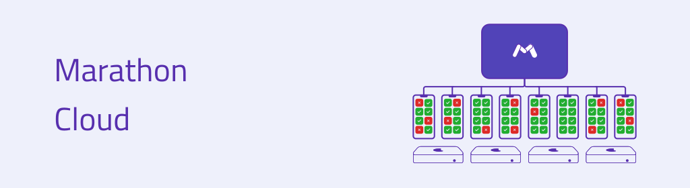

<h1 align="center">
  
</h1>

<div align="center">

[![GitHub release][img-version-badge]][repo] [![Slack][img-slack-badge]][slack] [![Telegram][img-telegram-badge]][telegram] [![PRs Welcome][prs-badge]][prs]

[Releases][release]&nbsp;&nbsp;&nbsp;|&nbsp;&nbsp;&nbsp;[Documentation][docs]&nbsp;&nbsp;&nbsp;

</div>

**Marathon** is a project that helps execute tests in the shortest time possible. Specifically it helps with **stability** of test execution adjusting for flakiness in the environment and in the tests and also achieves best **performance** using high parallelization

## TL;DR
Marathon is a fast, platform-independent test runner focused on performance and stability. It offers easy to use platform implementations for Android and iOS as well as an API for use with custom hardware farms and more techstacks.

Marathon implements multiple key concepts of test execution such as test **batching**, **device pools**, test **sharding**, test **sorting**, **preventive retries** as well as **post-factum retries**. By default, most of these are set to conservative defaults but custom configurations are encouraged for those who want to optimize performance and/or stability.

Marathon's primary focus is on **full control over the balance between stability of test execution, testing performance and cost**.

For more information see the [documentation][docs]

### Overview
#### Performance
Marathon takes into account two key aspects of test execution:
* The duration of the test
* The probability of the test passing

Test run can only finish as quickly as possible if we plan the execution of tests with regard to the expected duration of the test. On the other hand, we need to address the flakiness of the environment and of the test itself. One key indicator of flakiness is the *probability* of the test passing.

Marathon takes a number of steps to ensure that each test run is as balanced as possible:
* The flakiness strategy queues up preventive retries for tests which are expected to fail during the test run according to the current real-time statistical data
* The sorting strategy forces long tests to be executed first so that if an unexpected retry attempt occurs it doesn't affect the test run significantly (e.g. at the end of execution)
* If all else fail we revert back to post-factum retries, but we try to limit their impact on the run with retry quotas

### Configuration

Create a basic **Marathonfile** in the root of your project with the following content:

Android:
```yaml
name: "My application"
outputDir: "build/reports/marathon"
vendorConfiguration:
  type: "Android"
  applicationApk: "dist/app-debug.apk"
  testApplicationApk: "dist/app-debug-androidTest.apk"
```

iOS:
```yaml
name: "My application"
outputDir: "derived-data/Marathon"
vendorConfiguration:
  type: "iOS"
  bundle:
    application: "sample.app"
    testApplication: "sampleUITests.xctest"
    testType: xcuitest
```

Vendor section describes platform specific details.

Since iOS doesn't have any way to discover remote execution devices you have to provide your simulators using the **Marathondevices** file:

```yaml
workers:
  - transport:
      type: local
    devices:
      - type: simulator
        udid: "XXXXXXXX-XXXX-XXXX-XXXX-XXXXXXXXXXXX"
      - type: simulatorProfile
        deviceType: com.apple.CoreSimulator.SimDeviceType.iPhone-13-mini
```

This **Marathondevices** file specifies a list of macOS instances and simulators for use. Marathon can use pre-provisioned simulators, but it can also provision new ones if needed.

Example above uses the local instance where marathon is executed, but you can connect many more instance via SSH.

> ℹ️ The instance where you run marathon is not limited to macOS: if you're using remote macOS instances then
you can easily start your marathon run from Linux for example.

You can find more information on providing devices in the [workers documentation][docs-workers]

The file structure for testing should look something like this:

Android:
```shell-session
foo@bar $ tree .  
.
├── Marathonfile
├── dist
│   ├── app-debug.apk
│   ├── app-debug-androidTest.apk
```

iOS:
```shell-session
foo@bar $ tree .  
.
├── Marathondevices
├── Marathonfile
├── build
│   ├── my.app
│   ├── my.xctest

```

### Execution

Start the test runner in the root of your project
```bash
$ marathon 
XXX [main] INFO com.malinskiy.marathon.cli.ApplicationView - Starting marathon
XXX [main] INFO com.malinskiy.marathon.cli.config.ConfigFactory - Checking Marathonfile config
...
```

### Requirements
Marathon requires Java Runtime Environment 8 or higher.

## Move even faster with Marathon Cloud
<h1 align="center">
  
</h1>
Marathon Cloud is a scalable testing-as-a-service product designed and developed by us, the creators of Marathon. It's got all the cloud testing infrastructure you need to run any number of tests in less than 15 minutes, 
whether you're a startup or a large enterprise.

[Learn more][marathon-cloud]

## Contributing

See [contributing docs][contributing]

## License

Marathon codebase is GPL 2.0 [LICENSE][LICENSE] with following optional components under specific licenses:
* [libxctest-parser][libxctest-parser-license]

<!--
Repo References
-->
[repo]:https://github.com/MarathonLabs/marathon

<!--
Link References
-->
[img-version-badge]:https://img.shields.io/github/release/MarathonLabs/marathon.svg?style=for-the-badge
[img-slack-badge]:https://img.shields.io/badge/Chat-Slack-49c39e?style=for-the-badge
[img-telegram-badge]:https://img.shields.io/badge/Chat-Telegram-0088CC?style=for-the-badge

[slack]:https://bit.ly/2LLghaW
[telegram]:https://t.me/marathontestrunner
[prs-badge]: https://img.shields.io/badge/PRs-welcome-brightgreen.svg?style=for-the-badge&logo=data%3Aimage%2Fsvg%2Bxml%3Bbase64%2CPD94bWwgdmVyc2lvbj0iMS4wIiBlbmNvZGluZz0iVVRGLTgiPz48c3ZnIGlkPSJzdmcyIiB3aWR0aD0iNjQ1IiBoZWlnaHQ9IjU4NSIgdmVyc2lvbj0iMS4wIiB4bWxucz0iaHR0cDovL3d3dy53My5vcmcvMjAwMC9zdmciPiA8ZyBpZD0ibGF5ZXIxIj4gIDxwYXRoIGlkPSJwYXRoMjQxNyIgZD0ibTI5Ny4zIDU1MC44N2MtMTMuNzc1LTE1LjQzNi00OC4xNzEtNDUuNTMtNzYuNDM1LTY2Ljg3NC04My43NDQtNjMuMjQyLTk1LjE0Mi03Mi4zOTQtMTI5LjE0LTEwMy43LTYyLjY4NS01Ny43Mi04OS4zMDYtMTE1LjcxLTg5LjIxNC0xOTQuMzQgMC4wNDQ1MTItMzguMzg0IDIuNjYwOC01My4xNzIgMTMuNDEtNzUuNzk3IDE4LjIzNy0zOC4zODYgNDUuMS02Ni45MDkgNzkuNDQ1LTg0LjM1NSAyNC4zMjUtMTIuMzU2IDM2LjMyMy0xNy44NDUgNzYuOTQ0LTE4LjA3IDQyLjQ5My0wLjIzNDgzIDUxLjQzOSA0LjcxOTcgNzYuNDM1IDE4LjQ1MiAzMC40MjUgMTYuNzE0IDYxLjc0IDUyLjQzNiA2OC4yMTMgNzcuODExbDMuOTk4MSAxNS42NzIgOS44NTk2LTIxLjU4NWM1NS43MTYtMTIxLjk3IDIzMy42LTEyMC4xNSAyOTUuNSAzLjAzMTYgMTkuNjM4IDM5LjA3NiAyMS43OTQgMTIyLjUxIDQuMzgwMSAxNjkuNTEtMjIuNzE1IDYxLjMwOS02NS4zOCAxMDguMDUtMTY0LjAxIDE3OS42OC02NC42ODEgNDYuOTc0LTEzNy44OCAxMTguMDUtMTQyLjk4IDEyOC4wMy01LjkxNTUgMTEuNTg4LTAuMjgyMTYgMS44MTU5LTI2LjQwOC0yNy40NjF6IiBmaWxsPSIjZGQ1MDRmIi8%2BIDwvZz48L3N2Zz4%3D

[release]:https://github.com/MarathonLabs/marathon/releases/latest "Latest Release (external link) ➶"
[docs]:https://docs.marathonlabs.io
[docs-workers]:https://docs.marathonlabs.io/ios/workers
[contributing]:https://docs.marathonlabs.io/intro/contribute
[prs]:http://makeapullrequest.com "Make a Pull Request (external link) ➶"
[LICENSE]:https://github.com/MarathonLabs/marathon/blob/-/LICENSE
[libxctest-parser-license]: https://github.com/MarathonLabs/marathon/blob/-/vendor/vendor-apple/base/src/main/resources/EULA.md

[marathon-cloud]:https://marathonlabs.io
