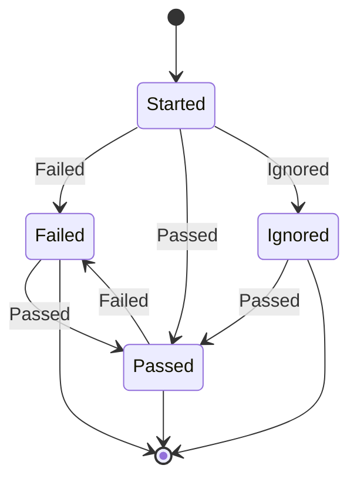
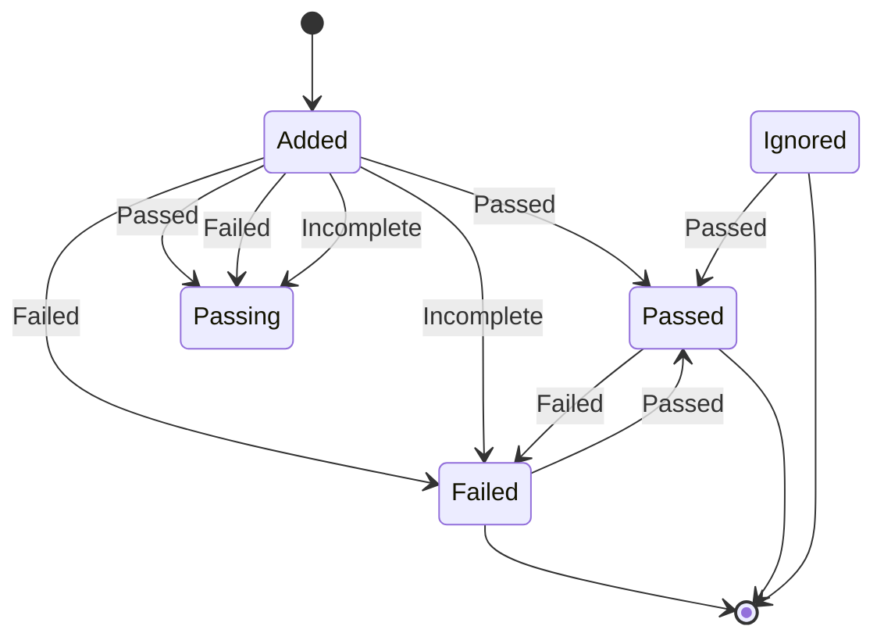

```mermaid
stateDiagram-v2
    [*] --> Started

    Started --> Failed : Failed
    Started --> Passed : Passed
    Started --> Ignored : Ignored
    
    Passed --> Failed : Failed
    
    Failed --> Passed : Passed
    
    Ignored --> Passed : Passed

    Failed --> [*]
    Passed --> [*]
    Ignored --> [*]
```

```mermaid
stateDiagram-v2
    [*] --> Added

    Added --> Passed : Passed
    Added --> Passing : Passed
    Added --> Failed : Failed
    Added --> Passing : Failed
    Added --> Failed : Incomplete
    Added --> Passing : Incomplete
    
    
    Passed --> Failed : Failed
    
    Failed --> Passed : Passed
    
    Ignored --> Passed : Passed

    Failed --> [*]
    Passed --> [*]
    Ignored --> [*]
```
