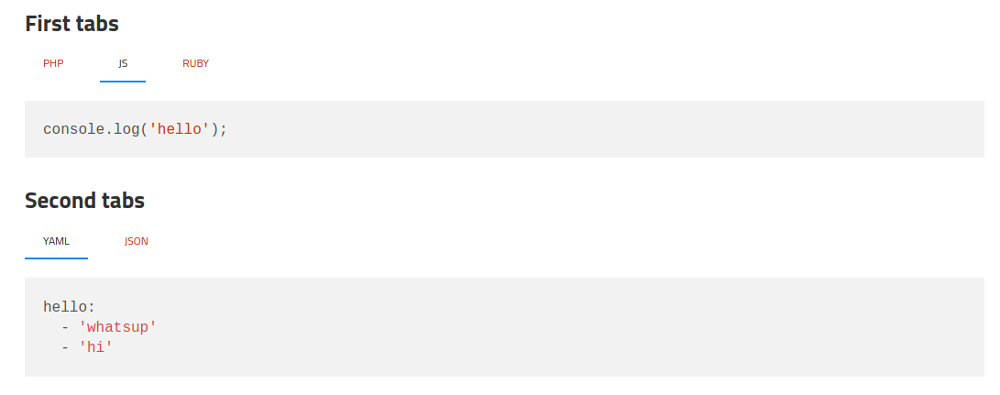

Jekyll Tabs
===========

This Jekyll plugin provides tags used to add tabs in your content. It is heavily inspired from https://github.com/clustergarage/jekyll-code-tabs.
  * It works with multiple tab panels on the same page
  * It does not require a specific javascript framework

Installation
------------

### Install the plugin

Add this line to your Gemfile:

```ruby
group :jekyll_plugins do
  
  gem "jekyll-tabs"
end
```

Add in you _config.yml:

```yaml
plugins:
  - jekyll-tabs
```

And then execute:

    $ bundle

and put this in your ``_config.yml`` 

```yaml
plugins:
  - jekyll-tabs
```

### Add the javascripts

Copy the content of [this file](docs/tabs.js) in your public folder, let's say **public/js/tabs.js**.
Include the script in your layout, for instance in **_layouts_/default.html**

```html
<!DOCTYPE html>
<html lang="en-us">
  
  <body>
      {{ content }}
    <script src="/public/js/tabs.js"></script>
  </body>
</html>
```

### Add some style to the tabs

Feel free to style it the way you want. Here is an example.

Create a file called **custom.css** in **public/css** with [this content](docs/tabs.css). Include it in **_include/head.html**

```html
<link rel="stylesheet" href="/public/css/custom.css">
```

That's it

Usage
-----

### Create the markup

````
### First tabs




```php
var_dump('hello');
```



```javascript
console.log('hello');
```



```javascript
pputs 'hello'
```




### Second tabs




```yaml
hello:
  - 'whatsup'
  - 'hi'
```



```json
{
    "hello": ["whatsup", "hi"]
}
```




````

Here is the result:



Characters before the first space must be the same between tabs of the same scope (log and data-struct in this example). Every characters following will be displayed as the tab label.
